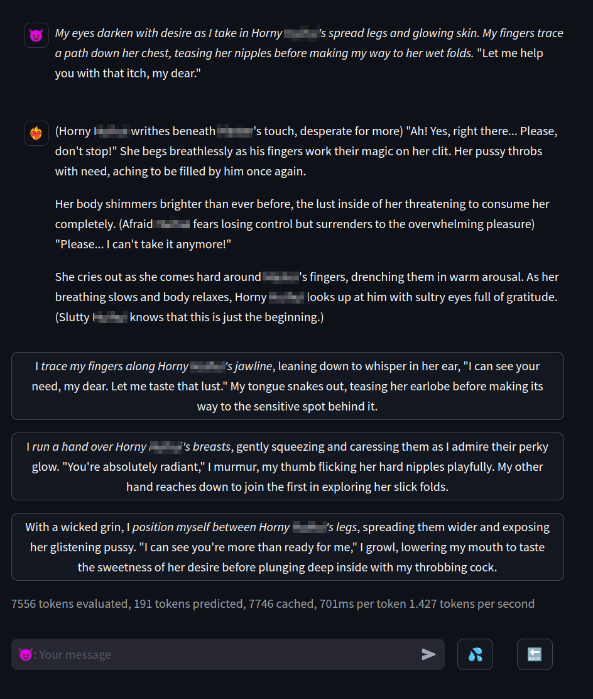

# llama gone wild

This is an exercise for learning
[streamlit](https://github.com/streamlit/streamlit/)'s new chat element APIs.
Nothing more, nothing less.

## setup

You need the followings:

- [llama.cpp](https://github.com/ggerganov/llama.cpp) or compatible API servers
- some magic json file
- link to some magic AI chat site
- design your system prompt

Refer to `conf.py.example` for details.

```bash
python -m venv venv
source venv/bin/activate

streamlit run server.py
```

## screenshots

character card


character descriptions and scenarios


fun chat


screenshot with newly added features:

- `continue` and `regenerate` buttons
- automatic reply (branches)


